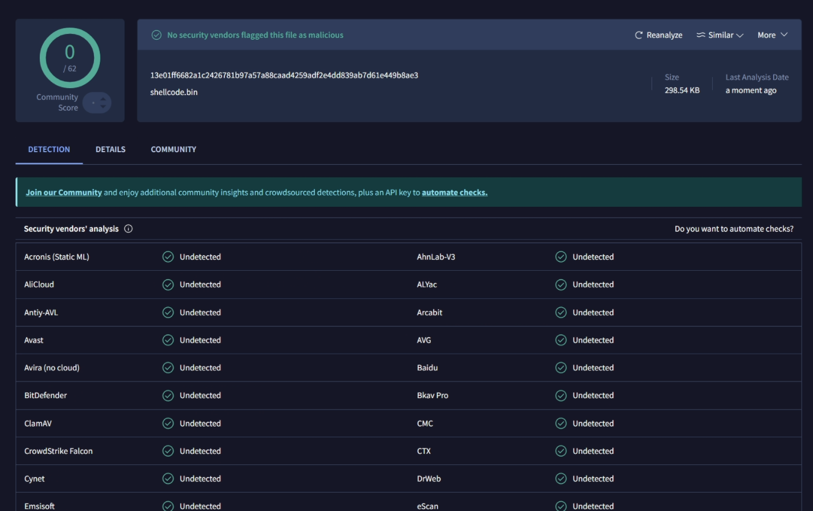
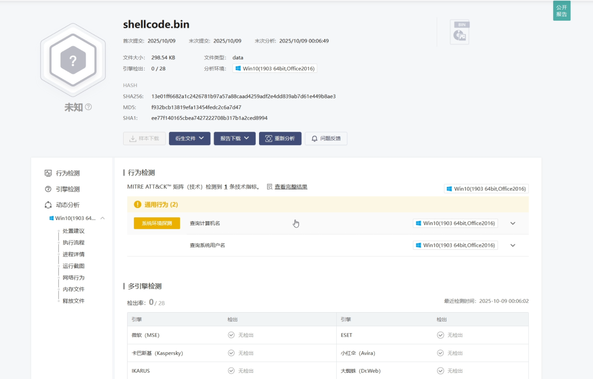
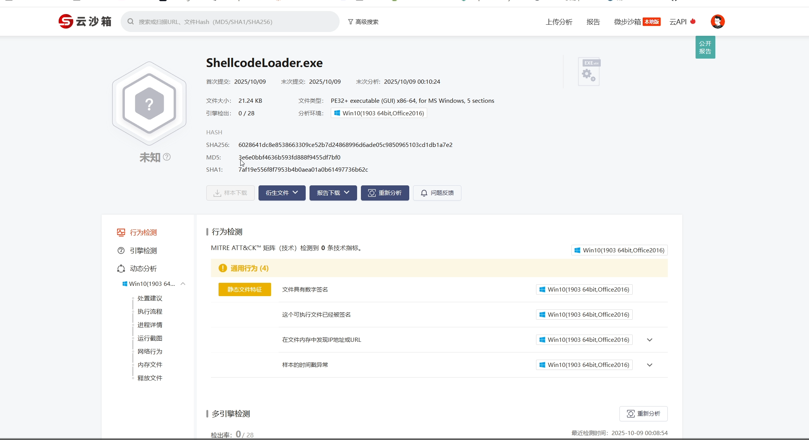
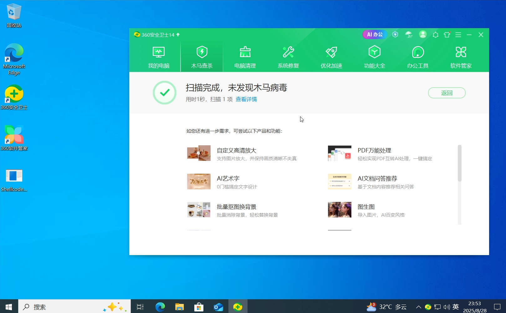
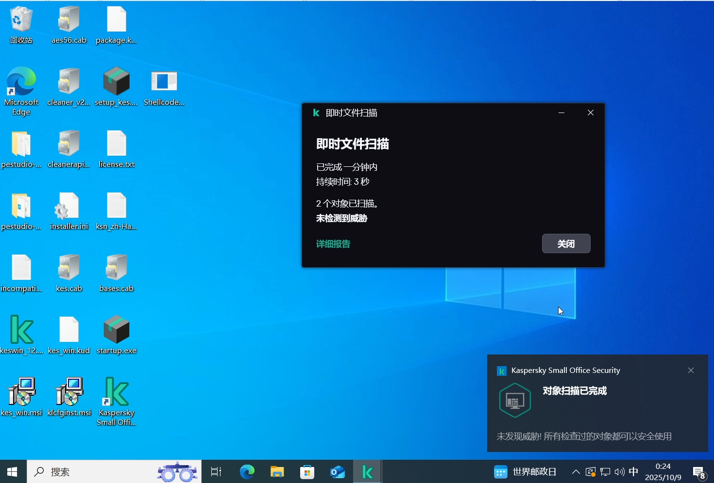
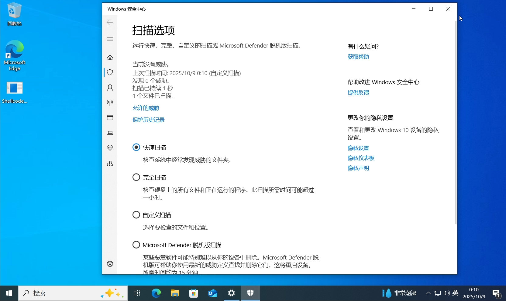
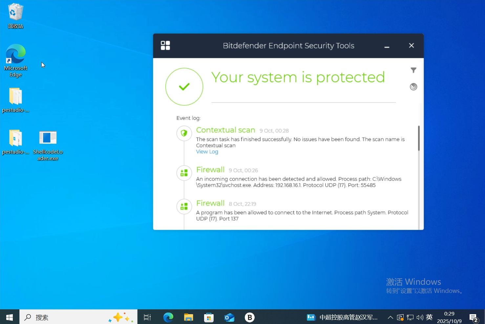

# bypass-all

免责声明：

视频中所有操作均在受控的靶机环境中完成，不存在任何实际攻击行为，请大家务必遵守法律法规，切勿将此类技术用于非法用途

介绍：

arsenal-kit 二开：

此项目为UDRL-VS二开、process inject kit二开 ，去除yara特征的profile，简单的shellcodeloader为单文件远程分离加载

使用方法参考视频：

https://www.bilibili.com/video/BV1Mp47z1EMW/?vd_source=23bb70e55009a3bee5844639552aeb7e

证明：

测试时间：2025.10.09

 

 

 

 

 

 

  
